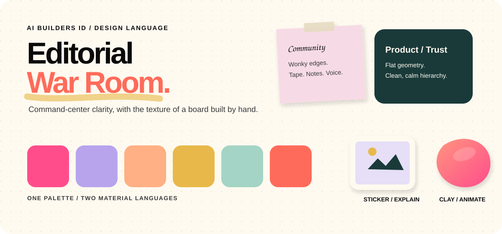

# AI Builders ID — Design System

> **Editorial War Room** — command-center clarity with the texture of a board built by hand.



AI Builders ID combines monumental editorial typography with the tactile character of a digital whiteboard: warm cream canvas, dot-grid texture, taped sticky notes, rough marker highlights, saturated color, and deliberately imperfect details.

This repository is the visual source of truth for keeping that contrast coherent—not chaotic.

## Design Language at a Glance

| Layer | Language | Use it for |
|---|---|---|
| **Editorial** | Large, tight Space Grotesk hierarchy | Headlines, structure, clarity, trust |
| **War Room** | Notes, tape, dot-grid, rough marks | Community, process, personality, annotations |
| **Flat Product** | Clean radius, saturated fills, no shadow | Product features, pricing, proof, conversion |
| **Illustration** | Stickers explain; clay animates | Concepts, workflows, focal brand moments |

### The central tension

```text
PRINTED / PRECISE                         PINNED / HUMAN
Space Grotesk                             Permanent Marker
clean product cards        +              wonky sticky notes
flat hierarchy                            tape, grain, rough lines
```

The system works when both sides remain visible. Permanent Marker supports the hierarchy; it never replaces it. Playful components carry personality; clean components carry decisions and trust.

## Palette

| Ink | Pink | Teal | Lavender | Peach | Ochre | Mint | Coral |
|---|---|---|---|---|---|---|---|
| `#0a0a0a` | `#ff4d8b` | `#1a3a3a` | `#b8a4ed` | `#ffb084` | `#e8b94a` | `#a4d4c5` | `#ff6b5a` |

The default canvas is warm cream `#fffaf0`. Brand hues drive both sticky-note tints and saturated flat cards, keeping playful and product zones in the same visual family. Teal is reserved for a featured or pinned signal.

## Typography

| Role | Typeface | Rule |
|---|---|---|
| **Display** | Space Grotesk 600–700 | Monumental scale, tight leading, negative tracking |
| **Body** | Space Grotesk 400 | Calm, readable, and structurally neutral |
| **Annotation** | Permanent Marker | Small, secondary, slightly rotated; never a primary heading |
| **Label** | Space Grotesk uppercase | Compact editorial metadata and occasional eyebrows |

```text
Build the future.        ← display / decisive
with people, not hype    ← annotation / human
```

## Two Component Zones

### Playful / Community

- Wonky sketch or sticky-note radii
- Tape, translucent ink borders, and soft lifted shadows
- Handwritten annotations below `24px`
- Best for stories, testimonials, community moments, and working notes

### Product / Trust

- Clean `8 / 12 / 16 / 24px` radius scale
- Flat color or paper surfaces with restrained hairlines
- No decorative drop shadow on feature cards
- Best for product UI, features, pricing, forms, and calls to action

Do not blend both shape languages inside one component. Alternate zones at section level instead.

## Illustration System

| Sticker — Explain | Clay — Animate | UI — Operate |
|---|---|---|
| Static, die-cut, lightly imperfect | Matte, tactile, softly moving | Functional, semantic, accessible |
| Topics, workflows, article covers | Hero moments, transitions, showcases | Reading, decisions, controls |
| SVG, WebP, PNG | WebM, MP4, GLB | HTML, CSS, JS |

> If a visual helps someone **understand**, use a Sticker. If it helps someone **feel** the brand's energy, use Clay. The UI remains responsible for operation and accessibility.

Clay is a focal layer, not a card treatment. Prefer one clay moment per page, preserve a stable poster for reduced motion, and use stickers for supporting explanation.

## Non-Negotiable Signatures

- Warm cream canvas and subtle dot-grid
- Space Grotesk as the primary hierarchy
- Permanent Marker only as an annotation
- Tape, sticky notes, and rough underline used with purpose
- Brand hues cycled without repeating adjacent colors
- Teal reserved for one featured signal per section
- `96px` major section rhythm and generous editorial whitespace

## Documentation

- [`ai-builders-design-system.md`](./ai-builders-design-system.md) — complete specification, tokens, components, responsive behavior, migration notes, and illustration architecture
- [`ai-builders-design-system.html`](./ai-builders-design-system.html) — live visual preview of the core language and components
- [`illustrations-stickers.md`](./illustrations-stickers.md) — static sticker-sheet art direction
- [`illustrations-clay-keyboard.md`](./illustrations-clay-keyboard.md) — clay keyboard material and motion study
- [`illustrations-clay-ai-agents.md`](./illustrations-clay-ai-agents.md) — clay AI-agent material and motion study

## Starting a New Section

1. Choose the zone: **playful/community** or **product/trust**.
2. Establish the Space Grotesk headline before adding decoration.
3. Add handwriting only when a real human annotation improves the message.
4. Cycle colors from the defined palette; reserve teal for the featured element.
5. Keep the dot-grid, tape, or rough underline present as a subtle tactile signature.
6. Use Sticker to explain, Clay to animate, and semantic UI to operate.

The full implementation rules and token values live in [`ai-builders-design-system.md`](./ai-builders-design-system.md).
